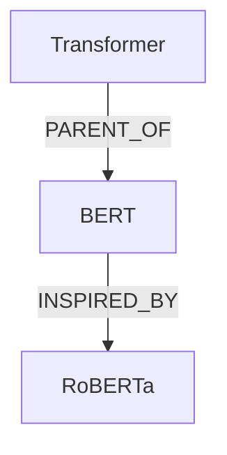

# 本地论文知识图谱系统需求文档

> **文档状态：初始产品愿景与候选需求。** 本文保留最初的目标和设计设想，不代表仓库已经实现全部条目。PDF、JSON 导入导出、自动保存、多项目管理、认证、通用数据库迁移和自动化测试等能力仍可能处于待开发状态。当前事实请以源码和 [实现状态](./dev_docs/implementation-status.md)、[任务状态](./dev_docs/tasks.md)、[API 文档](./dev_docs/api.md) 为准。

## 1. 项目概述

### 1.1 项目名称

暂定名称：**Local Research Graph**

中文名称：**本地论文知识图谱系统**

### 1.2 项目目标

开发一套运行在本地计算机或本地服务器上的论文知识管理系统，通过浏览器访问。

系统以“论文节点”为核心，允许用户：

* 创建和管理论文节点；
* 为论文记录结构化属性；
* 在可视化画布中自由排列节点；
* 创建父子关系和任意有向关系；
* 编辑节点之间的关系类型；
* 使用 Markdown 保存论文笔记；
* 导出整个知识图谱及论文信息；
* 后续接入本地或远程大语言模型，自动提取论文内容并进行知识图谱问答。

系统应坚持以下原则：

1. 本地优先；
2. 数据可迁移；
3. 文件格式开放；
4. 不依赖特定云服务；
5. 浏览器访问；
6. 支持未来扩展 AI、PDF 解析和多人协作能力。

---

# 2. 使用场景

## 2.1 核心使用流程

用户在阅读论文时，可以执行以下操作：

1. 在系统中新建论文节点；
2. 填写论文标题、作者、年份、会议等基本信息；
3. 填写论文的任务、方法、主要贡献、局限性等结构化属性；
4. 上传或关联论文 PDF；
5. 在 Markdown 编辑器中记录详细笔记；
6. 将论文节点拖动到知识图谱画布中；
7. 建立论文之间的父子关系；
8. 建立 Improve、Extend、Compare 等语义关系；
9. 对论文节点进行分类、筛选和搜索；
10. 将整个知识图谱导出为 Markdown、JSON 或其他开放格式。

## 2.2 典型关系示例

论文之间允许存在以下关系：

* Parent Of：父节点；
* Child Of：子节点；
* Based On：基于；
* Improve：改进；
* Extend：扩展；
* Compare With：对比；
* Inspired By：受启发于；
* Use Method：使用某方法；
* Use Dataset：使用某数据集；
* Same Task：解决相同任务；
* Contradict：结论冲突；
* Related To：一般相关关系。

用户可以创建自定义关系类型。

---

# 3. 系统边界

## 3.1 MVP 必须实现

第一阶段必须实现：

1. 本地 Web 服务；
2. 论文节点增删改查；
3. 论文结构化属性管理；
4. Markdown 笔记编辑；
5. 图形化画布；
6. 自由拖拽节点；
7. 创建有向边；
8. 创建父子关系；
9. 编辑关系类型；
10. 图谱自动保存；
11. 节点搜索和基础筛选；
12. Markdown 导出；
13. JSON 导出与导入；
14. 本地数据持久化；
15. PDF 文件上传和关联。

## 3.2 MVP 暂不实现

第一阶段不要求实现：

* 多用户实时协作；
* 公网部署；
* 用户注册和复杂权限；
* 自动抓取所有论文元数据；
* 完整 Zotero 双向同步；
* 复杂 GraphRAG；
* 自动生成综述；
* 自动生成 PPT；
* 移动端原生应用；
* 云端同步；
* 实时多人编辑；
* Neo4j 等独立图数据库。

上述功能应在架构上保留扩展可能，但不得影响 MVP 交付。

---

# 4. 系统部署要求

## 4.1 运行方式

系统运行在用户本地，启动后通过浏览器访问，例如：

```text
http://localhost:3000
```

或：

```text
http://127.0.0.1:3000
```

如果部署在局域网服务器，应支持通过局域网 IP 访问：

```text
http://192.168.1.100:3000
```

## 4.2 推荐启动方式

至少支持以下一种方式：

### 方式一：Docker Compose

```bash
docker compose up -d
```

### 方式二：本地开发模式

前端：

```bash
npm install
npm run dev
```

后端：

```bash
pip install -r requirements.txt
python main.py
```

优先提供 Docker Compose，降低环境配置成本。

## 4.3 数据存储位置

所有用户数据必须保存在明确的本地工作目录中，例如：

```text
workspace/
├── database/
│   └── research_graph.db
├── papers/
│   ├── paper-001.md
│   └── paper-002.md
├── pdfs/
│   ├── paper-001.pdf
│   └── paper-002.pdf
├── assets/
├── exports/
├── backups/
└── config/
```

用户应能够配置工作目录位置。

---

# 5. 功能需求

## 5.1 首页与项目管理

### 5.1.1 项目概念

系统应支持创建多个独立研究项目。

例如：

* 多模态一致性；
* 虚拟患者；
* 数字人生成；
* 心理咨询大模型。

每个项目拥有独立的：

* 论文节点；
* 图谱；
* 关系；
* 标签；
* 导出文件；
* 画布布局。

### 5.1.2 项目功能

用户可以：

* 新建项目；
* 修改项目名称；
* 修改项目描述；
* 打开项目；
* 删除项目；
* 导出项目；
* 导入项目；
* 复制项目；
* 查看最近打开项目。

删除项目时应二次确认。

---

## 5.2 论文节点管理

### 5.2.1 新建论文节点

用户可以通过以下方式新建论文节点：

1. 点击“新建论文”按钮；
2. 在画布空白处右键新建；
3. 通过快捷键新建；
4. 导入 Markdown；
5. 导入 JSON；
6. 后续通过 PDF 自动解析创建。

### 5.2.2 论文基础属性

每篇论文至少包含以下字段：

| 字段         | 类型       | 必填 |
| ---------- | -------- | -- |
| id         | UUID     | 是  |
| title      | string   | 是  |
| title_cn   | string   | 否  |
| authors    | string[] | 否  |
| year       | integer  | 否  |
| venue      | string   | 否  |
| venue_type | enum     | 否  |
| doi        | string   | 否  |
| arxiv_id   | string   | 否  |
| url        | string   | 否  |
| code_url   | string   | 否  |
| pdf_path   | string   | 否  |
| status     | enum     | 否  |
| rating     | integer  | 否  |
| tags       | string[] | 否  |
| created_at | datetime | 是  |
| updated_at | datetime | 是  |

`venue_type` 建议值：

* Journal；
* Conference；
* Workshop；
* Preprint；
* Thesis；
* Other。

`status` 建议值：

* Unread；
* Reading；
* Read；
* Important；
* Archived。

### 5.2.3 学术结构化属性

每篇论文应支持以下结构化字段：

| 字段                | 含义      |
| ----------------- | ------- |
| task              | 论文解决的任务 |
| motivation        | 研究动机    |
| research_gap      | 现有研究缺口  |
| input             | 模型或系统输入 |
| output            | 模型或系统输出 |
| method            | 核心方法    |
| key_contributions | 主要贡献    |
| datasets          | 使用的数据集  |
| metrics           | 评测指标    |
| baselines         | 对比方法    |
| results           | 主要结果    |
| limitations       | 局限性     |
| future_work       | 未来工作    |
| application       | 应用场景    |
| keywords          | 关键词     |
| personal_notes    | 用户个人判断  |

其中以下字段应支持多条列表项：

* key_contributions；
* datasets；
* metrics；
* baselines；
* results；
* limitations；
* future_work；
* keywords。

### 5.2.4 自定义属性

用户应能够为论文节点添加自定义属性。

自定义属性至少支持以下类型：

* 单行文本；
* 多行文本；
* 数字；
* 布尔值；
* 日期；
* 单选；
* 多选；
* URL；
* 节点引用；
* 字符串列表。

示例：

```text
临床价值：高
是否开源：是
适合复现：否
研究路线：心理状态驱动数字人
```

自定义字段定义应保存在项目级配置中。

---

## 5.3 Markdown 笔记

### 5.3.1 编辑器

每篇论文应有独立 Markdown 笔记。

编辑器至少支持：

* 标题；
* 加粗；
* 斜体；
* 列表；
* 任务列表；
* 表格；
* 引用；
* 代码块；
* 图片；
* 数学公式；
* 内部节点链接；
* Markdown 预览；
* 自动保存。

### 5.3.2 节点引用

Markdown 中应支持通过论文节点 ID 或别名引用其他论文。

推荐格式：

```markdown
[[paper-id]]
```

或：

```markdown
[[论文标题]]
```

系统应将引用显示为可点击链接。

### 5.3.3 自动生成 Markdown 文件

每个论文节点应能够映射为独立 Markdown 文件。

推荐格式：

```markdown
---
id: paper-uuid
title: Attention Is All You Need
authors:
  - Ashish Vaswani
year: 2017
venue: NeurIPS
tags:
  - Transformer
  - NLP
status: read
---

# Task

Sequence modeling

# Motivation

...

# Key Contributions

- 提出 Transformer 架构
- 使用自注意力替代循环结构

# Method

...

# Limitations

...

# Notes

...
```

数据库中的结构化字段与 Markdown Frontmatter 之间应具有明确映射关系。

MVP 可以采用“数据库为主、Markdown 为导出文件”的方式，但应避免不可逆的数据格式。

---

## 5.4 PDF 管理

### 5.4.1 PDF 上传

用户可以为论文节点上传 PDF。

系统应：

* 将 PDF 复制到项目的本地 PDF 目录；
* 使用节点 ID 或安全文件名保存；
* 记录原始文件名；
* 防止同名文件覆盖；
* 支持替换和删除 PDF；
* 删除节点时询问是否同时删除 PDF。

### 5.4.2 PDF 查看

MVP 至少支持：

* 在新浏览器标签中打开 PDF；
* 下载 PDF；
* 显示本地文件路径；
* 检查 PDF 是否存在。

可选实现内嵌 PDF 阅读器，但不作为 MVP 阻塞项。

---

## 5.5 图形化画布

### 5.5.1 基本画布能力

画布应支持：

* 无限画布；
* 鼠标拖动画布；
* 滚轮缩放；
* 框选节点；
* 多选节点；
* 拖动节点；
* 对齐辅助线；
* 自动保存节点位置；
* 撤销；
* 重做；
* 删除；
* 复制；
* 粘贴；
* 键盘快捷键；
* 小地图；
* 适配全部节点；
* 跳转到指定节点。

推荐使用成熟图编辑框架，例如：

* React Flow；
* Cytoscape.js；
* AntV X6。

优先考虑 React Flow。

### 5.5.2 节点显示内容

节点卡片默认显示：

* 论文标题；
* 年份；
* 会议或期刊；
* 标签；
* 最多两条主要贡献；
* 阅读状态；
* 是否关联 PDF。

节点卡片应支持折叠和展开。

### 5.5.3 节点样式

节点应支持：

* 自定义颜色；
* 根据标签自动着色；
* 根据阅读状态显示图标；
* 根据年份或类型显示不同边框；
* 调整节点宽度；
* 紧凑模式；
* 详细模式。

### 5.5.4 节点创建

用户可以在画布中：

* 双击空白位置创建论文节点；
* 右键空白位置创建论文节点；
* 从论文列表拖入画布；
* 在已有节点上创建子节点；
* 从已有节点快速创建关联节点。

### 5.5.5 画布布局

每个项目应保存至少一个默认画布。

后续可扩展多个视图，例如：

* 总图谱；
* 方法演进；
* 时间线；
* 研究方向；
* 当前阅读列表。

MVP 可以只实现单画布，但数据模型应允许未来增加多个画布。

---

## 5.6 节点关系

### 5.6.1 有向关系

用户可以从节点 A 拖出连线指向节点 B。

关系必须保存方向：

```text
source → target
```

### 5.6.2 关系字段

每条关系至少包含：

| 字段            | 类型       |
| ------------- | -------- |
| id            | UUID     |
| source_id     | UUID     |
| target_id     | UUID     |
| relation_type | string   |
| label         | string   |
| description   | text     |
| confidence    | float    |
| created_at    | datetime |
| updated_at    | datetime |

### 5.6.3 父子关系

父子关系作为特殊的有向关系实现。

推荐关系类型：

```text
PARENT_OF
```

例如：

```text
Transformer → BERT
```

含义为 Transformer 是 BERT 的父节点或上位工作。

系统应能够从 `PARENT_OF` 自动推导：

* 父节点；
* 子节点；
* 祖先节点；
* 后代节点。

MVP 不强制限制一个节点只有一个父节点。一个节点可以有多个父节点。

### 5.6.4 关系类型管理

系统预置以下关系：

| 关系代码          | 显示名称  |
| ------------- | ----- |
| PARENT_OF     | 父级    |
| BASED_ON      | 基于    |
| IMPROVES      | 改进    |
| EXTENDS       | 扩展    |
| COMPARES_WITH | 对比    |
| INSPIRED_BY   | 受启发于  |
| USES_METHOD   | 使用方法  |
| USES_DATASET  | 使用数据集 |
| SAME_TASK     | 相同任务  |
| CONTRADICTS   | 结论冲突  |
| RELATED_TO    | 相关    |

用户可以：

* 新建关系类型；
* 修改显示名称；
* 修改颜色；
* 修改线条样式；
* 删除自定义关系类型；
* 设置是否有方向；
* 设置默认关系描述。

删除关系类型时，不应直接删除已有关系，必须要求用户选择替代类型或确认删除。

### 5.6.5 关系编辑

点击边后，右侧面板应显示：

* 起始节点；
* 目标节点；
* 关系类型；
* 自定义标签；
* 关系说明；
* 置信度；
* 删除按钮。

### 5.6.6 防止非法关系

系统应进行以下校验：

* source_id 不得为空；
* target_id 不得为空；
* source_id 和 target_id 默认不得相同；
* 同类型重复边应提示；
* 删除节点时提示关联边数量；
* 父子关系形成环时给出警告。

MVP 可以允许存在环，但必须给出可见提示。

---

## 5.7 节点详情面板

点击节点后，在右侧打开详情面板。

建议分为以下标签页：

### 基础信息

* 标题；
* 作者；
* 年份；
* 会议；
* DOI；
* URL；
* 标签；
* 阅读状态。

### 论文分析

* Task；
* Motivation；
* Research Gap；
* Input；
* Output；
* Method；
* Contributions；
* Datasets；
* Metrics；
* Results；
* Limitations；
* Future Work。

### Markdown 笔记

显示 Markdown 编辑器。

### 关系

显示：

* 父节点；
* 子节点；
* 入边；
* 出边；
* 每条关系的类型和说明。

### 文件

显示：

* PDF；
* 附件；
* 本地路径。

---

## 5.8 搜索与筛选

### 5.8.1 全局搜索

支持搜索以下内容：

* 标题；
* 中文标题；
* 作者；
* 会议；
* 标签；
* Task；
* Contribution；
* Method；
* Limitation；
* Markdown 笔记。

### 5.8.2 筛选条件

至少支持：

* 年份范围；
* 会议；
* 阅读状态；
* 标签；
* 是否存在 PDF；
* 是否存在父节点；
* 是否存在子节点；
* 关系类型；
* 评分；
* 自定义属性。

### 5.8.3 搜索结果行为

点击搜索结果后：

* 在画布中定位对应节点；
* 自动居中；
* 高亮节点；
* 打开详情面板。

---

# 6. 导入与导出

## 6.1 项目 JSON 导出

系统应能够将整个项目导出为 JSON。

示例结构：

```json
{
  "version": "1.0",
  "project": {
    "id": "project-001",
    "name": "Multimodal Consistency"
  },
  "papers": [],
  "relations": [],
  "canvas": {
    "nodes": [],
    "viewport": {}
  },
  "custom_fields": [],
  "relation_types": []
}
```

JSON 导出必须完整保留：

* 所有论文节点；
* 所有属性；
* 所有关系；
* 节点位置；
* 画布视角；
* 自定义字段；
* 自定义关系类型；
* 项目配置。

## 6.2 项目 JSON 导入

系统应支持导入自身导出的 JSON。

导入前应进行：

* 版本校验；
* 数据格式校验；
* ID 冲突检查；
* 文件缺失检查；
* 导入预览；
* 错误提示。

## 6.3 Markdown 导出

### 单篇论文导出

将一篇论文导出为一个 Markdown 文件。

### 全项目导出

全项目导出为目录：

```text
export/
├── README.md
├── graph.md
├── papers/
│   ├── paper-001.md
│   └── paper-002.md
├── graph.json
└── assets/
```

### graph.md 格式

`graph.md` 应描述节点和关系。

建议格式：

```markdown
# Research Graph

## Papers

- [[paper-001|Attention Is All You Need]]
- [[paper-002|BERT]]

## Relations

- [[paper-001]] --PARENT_OF--> [[paper-002]]
- [[paper-002]] --IMPROVES--> [[paper-003]]
```

也可以附加关系说明：

```markdown
- [[paper-002]] --EXTENDS--> [[paper-001]]
  - Description: 引入双向预训练编码器
```

### Mermaid 导出

建议支持将关系图导出为 Mermaid：



Mermaid 可作为 MVP 的增强项。

## 6.4 CSV 导出

建议支持将论文列表导出为 CSV。

至少包含：

* title；
* authors；
* year；
* venue；
* task；
* key_contributions；
* tags；
* status。

---

# 7. 数据模型

## 7.1 Project

```text
Project
- id
- name
- description
- workspace_path
- created_at
- updated_at
```

## 7.2 Paper

```text
Paper
- id
- project_id
- title
- title_cn
- authors
- year
- venue
- venue_type
- doi
- arxiv_id
- url
- code_url
- pdf_path
- status
- rating
- tags
- task
- motivation
- research_gap
- input
- output
- method
- key_contributions
- datasets
- metrics
- baselines
- results
- limitations
- future_work
- application
- keywords
- personal_notes
- markdown_content
- custom_properties
- created_at
- updated_at
```

数组字段可使用 JSON 类型或关联表实现。

MVP 使用 SQLite 时，可以优先使用 JSON 字符串，后续再规范化。

## 7.3 Relation

```text
Relation
- id
- project_id
- source_id
- target_id
- relation_type_id
- label
- description
- confidence
- created_at
- updated_at
```

## 7.4 RelationType

```text
RelationType
- id
- project_id
- code
- name
- directed
- color
- line_style
- is_system
- created_at
- updated_at
```

## 7.5 CanvasNode

```text
CanvasNode
- id
- canvas_id
- paper_id
- x
- y
- width
- height
- collapsed
- style
```

## 7.6 Canvas

```text
Canvas
- id
- project_id
- name
- viewport_x
- viewport_y
- zoom
- created_at
- updated_at
```

## 7.7 CustomFieldDefinition

```text
CustomFieldDefinition
- id
- project_id
- field_key
- display_name
- field_type
- options
- required
- default_value
- created_at
- updated_at
```

---

# 8. 推荐技术架构

## 8.1 总体架构

采用前后端分离架构：

```text
Browser
   ↓
Frontend
   ↓ REST API
Backend
   ↓
SQLite + Local Files
```

## 8.2 前端推荐

* React；
* TypeScript；
* Vite；
* React Flow；
* Zustand；
* TanStack Query；
* Tailwind CSS；
* shadcn/ui；
* Monaco Editor 或 CodeMirror；
* Markdown 渲染使用 React Markdown。

### 前端职责

* 页面布局；
* 图谱编辑；
* 节点拖拽；
* 关系创建；
* 表单编辑；
* Markdown 编辑；
* 搜索筛选；
* 导入导出交互；
* 状态管理。

## 8.3 后端推荐

优先选择：

* Python；
* FastAPI；
* SQLAlchemy；
* Pydantic；
* Alembic；
* SQLite。

原因：

* 后续方便接入 PDF 解析；
* 方便接入本地 LLM；
* 方便做文本向量和 GraphRAG；
* 与科研 Python 生态兼容。

也可以使用 Node.js 后端，但需要说明与 Python AI 模块的集成方案。

## 8.4 数据库

MVP 使用 SQLite。

要求：

* 自动创建数据库；
* 支持迁移；
* 开启外键约束；
* 重要写操作使用事务；
* 定期备份；
* 不将二进制 PDF 存入数据库。

## 8.5 文件存储

文件存储在本地工作目录。

数据库只记录相对路径，不记录不可迁移的绝对路径。

例如：

```text
pdfs/paper-uuid.pdf
```

而不是：

```text
C:\Users\xxx\Documents\pdfs\paper.pdf
```

---

# 9. API 需求

## 9.1 项目接口

```text
GET    /api/projects
POST   /api/projects
GET    /api/projects/{project_id}
PUT    /api/projects/{project_id}
DELETE /api/projects/{project_id}
POST   /api/projects/{project_id}/export
POST   /api/projects/import
```

## 9.2 论文接口

```text
GET    /api/projects/{project_id}/papers
POST   /api/projects/{project_id}/papers
GET    /api/papers/{paper_id}
PUT    /api/papers/{paper_id}
DELETE /api/papers/{paper_id}
POST   /api/papers/{paper_id}/duplicate
```

## 9.3 PDF 接口

```text
POST   /api/papers/{paper_id}/pdf
GET    /api/papers/{paper_id}/pdf
DELETE /api/papers/{paper_id}/pdf
```

## 9.4 关系接口

```text
GET    /api/projects/{project_id}/relations
POST   /api/projects/{project_id}/relations
PUT    /api/relations/{relation_id}
DELETE /api/relations/{relation_id}
```

## 9.5 关系类型接口

```text
GET    /api/projects/{project_id}/relation-types
POST   /api/projects/{project_id}/relation-types
PUT    /api/relation-types/{relation_type_id}
DELETE /api/relation-types/{relation_type_id}
```

## 9.6 画布接口

```text
GET    /api/projects/{project_id}/canvases
POST   /api/projects/{project_id}/canvases
GET    /api/canvases/{canvas_id}
PUT    /api/canvases/{canvas_id}
POST   /api/canvases/{canvas_id}/save-layout
```

## 9.7 搜索接口

```text
GET /api/projects/{project_id}/search?q=xxx
```

建议支持筛选参数：

```text
year_from
year_to
venue
status
tags
has_pdf
relation_type
```

## 9.8 导出接口

```text
POST /api/projects/{project_id}/export/json
POST /api/projects/{project_id}/export/markdown
POST /api/projects/{project_id}/export/csv
POST /api/projects/{project_id}/export/mermaid
```

---

# 10. 页面设计

## 10.1 项目列表页

包含：

* 系统名称；
* 新建项目按钮；
* 导入项目按钮；
* 项目卡片；
* 最近修改时间；
* 论文数量；
* 关系数量；
* 打开、导出、复制、删除操作。

## 10.2 项目工作区

建议采用三栏结构：

```text
左侧栏        中央画布           右侧详情栏
论文列表      节点关系图         节点/边编辑
筛选器        无限画布           Markdown
标签          工具栏             属性
```

### 顶部工具栏

包含：

* 返回项目列表；
* 项目名称；
* 新建论文；
* 新建关系；
* 搜索；
* 导入；
* 导出；
* 保存状态；
* 设置。

### 左侧栏

包含：

* 论文列表；
* 标签；
* 筛选器；
* 未放入画布的论文；
* 最近修改论文。

### 中央区域

包含：

* 图谱画布；
* 缩放按钮；
* 自动布局；
* 适配画布；
* 小地图；
* 撤销；
* 重做。

### 右侧栏

根据选中内容显示：

* 论文详情；
* 关系详情；
* 项目设置；
* 自定义字段设置。

---

# 11. 自动保存与数据安全

## 11.1 自动保存

以下操作必须自动保存：

* 节点位置变化；
* 节点属性变化；
* Markdown 内容变化；
* 新建关系；
* 修改关系；
* 画布缩放和位置。

建议使用防抖保存：

```text
500ms 至 1500ms
```

界面显示保存状态：

* 已保存；
* 保存中；
* 保存失败；
* 存在未保存内容。

## 11.2 备份

系统应支持：

* 手动备份；
* 自动备份；
* 保留最近若干版本；
* 从备份恢复。

MVP 至少每日或每次启动时创建一次数据库备份。

建议目录：

```text
backups/
├── research_graph-2026-07-11-120000.db
└── research_graph-2026-07-12-120000.db
```

## 11.3 删除保护

删除以下内容需要确认：

* 项目；
* 论文节点；
* PDF；
* 关系类型；
* 自定义属性。

删除论文节点时显示：

* 关联关系数量；
* 子节点数量；
* PDF 是否会一并删除。

---

# 12. 非功能需求

## 12.1 性能

MVP 目标：

* 1000 个论文节点下可正常使用；
* 3000 条关系下可正常缩放和拖拽；
* 普通列表查询响应时间小于 500ms；
* 单次节点保存响应时间小于 500ms；
* 搜索响应时间小于 1 秒；
* 首屏加载时间小于 5 秒。

图谱节点数量较大时，应考虑：

* 局部渲染；
* 虚拟化；
* 分层加载；
* 简化节点内容；
* 关闭非必要动画。

## 12.2 兼容性

至少支持：

* Chrome；
* Edge。

系统主要面向桌面端，不要求第一阶段适配手机。

## 12.3 隐私

默认情况下：

* 不上传任何论文；
* 不上传任何笔记；
* 不调用第三方 API；
* 不包含行为统计；
* 不包含遥测；
* 不包含云端登录。

如果未来使用远程 AI API，必须由用户主动配置，并明确提示数据将离开本地环境。

## 12.4 可维护性

要求：

* 前后端类型清晰；
* 数据模型有迁移机制；
* 核心模块有单元测试；
* API 有统一错误格式；
* 日志保存到本地；
* 配置与代码分离；
* 不在代码中硬编码工作目录。

---

# 13. 错误处理

后端统一错误格式：

```json
{
  "code": "PAPER_NOT_FOUND",
  "message": "Paper not found",
  "details": {}
}
```

前端应针对以下错误给出明确提示：

* 数据库无法打开；
* 工作目录无权限；
* PDF 上传失败；
* 文件不存在；
* JSON 格式错误；
* 导入版本不兼容；
* 节点保存失败；
* 关系重复；
* 关系形成环；
* 导出失败；
* 磁盘空间不足。

不得只在浏览器控制台输出错误。

---

# 14. 快捷键

建议支持：

| 快捷键                  | 功能        |
| -------------------- | --------- |
| Ctrl/Cmd + N         | 新建论文      |
| Ctrl/Cmd + S         | 立即保存      |
| Ctrl/Cmd + Z         | 撤销        |
| Ctrl/Cmd + Shift + Z | 重做        |
| Delete               | 删除选中节点或边  |
| Ctrl/Cmd + C         | 复制        |
| Ctrl/Cmd + V         | 粘贴        |
| Ctrl/Cmd + F         | 搜索        |
| Ctrl/Cmd + A         | 全选画布节点    |
| Esc                  | 取消选择或关闭面板 |
| Space + Drag         | 拖动画布      |

快捷键应避免与浏览器关键操作发生严重冲突。

---

# 15. MVP 迭代计划

## 阶段 0：技术验证

目标：验证核心图谱编辑能力。

实现：

* React Flow 示例；
* 创建节点；
* 拖拽节点；
* 连接节点；
* 保存和恢复布局；
* FastAPI 与 SQLite 通信；
* 基础 Docker Compose。

输出：

* 可运行原型；
* 技术选型报告；
* 风险清单。

## 阶段 1：基础论文管理

实现：

* 项目管理；
* 论文节点 CRUD；
* 基础属性；
* 学术结构化字段；
* 论文列表；
* 详情面板；
* SQLite 数据持久化。

验收：

* 用户可以创建项目；
* 可以添加论文；
* 重启系统后数据仍存在；
* 可以修改和删除论文。

## 阶段 2：图谱编辑

实现：

* 无限画布；
* 拖拽；
* 缩放；
* 节点位置保存；
* 有向边；
* 父子关系；
* 关系类型；
* 关系编辑面板；
* 搜索定位。

验收：

* 用户可以创建 50 个节点；
* 可以自由排列；
* 可以创建不同类型的关系；
* 重启后布局和关系不丢失。

## 阶段 3：Markdown 与 PDF

实现：

* Markdown 编辑器；
* 自动保存；
* PDF 上传；
* PDF 打开；
* 节点内部链接；
* Markdown 导出。

验收：

* 每篇论文均有独立笔记；
* PDF 可以关联和打开；
* 全项目可以导出为 Markdown 目录。

## 阶段 4：导入导出和备份

实现：

* JSON 导出；
* JSON 导入；
* CSV 导出；
* 项目备份；
* 数据恢复；
* 导入数据校验。

验收：

* 项目可完整导出；
* 在新环境中可以恢复；
* 节点、关系、布局和自定义字段不丢失。

## 阶段 5：体验优化

实现：

* 快捷键；
* 多选；
* 框选；
* 撤销重做；
* 小地图；
* 节点样式；
* 标签筛选；
* 性能优化；
* 完整错误提示。

---

# 16. MVP 验收标准

系统满足以下条件，视为 MVP 完成。

## 16.1 部署

* 可以通过 Docker Compose 启动；
* 启动后浏览器可以访问；
* 无需依赖公网服务；
* 重启后数据保留。

## 16.2 节点

* 可以创建、查看、修改、删除论文节点；
* 每个节点可以保存结构化论文属性；
* 每个节点可以保存 Markdown 笔记；
* 每个节点可以关联 PDF；
* 可以添加自定义属性。

## 16.3 图谱

* 可以拖拽节点；
* 可以缩放和平移画布；
* 可以创建有向边；
* 可以设置关系类型；
* 可以建立父子关系；
* 可以编辑和删除关系；
* 节点位置可以保存；
* 重启后图谱保持一致。

## 16.4 搜索

* 可以根据标题搜索；
* 可以根据标签筛选；
* 可以根据年份筛选；
* 搜索结果可以定位到画布节点。

## 16.5 导出

* 可以导出完整 JSON；
* 可以重新导入 JSON；
* 可以导出单篇 Markdown；
* 可以导出全项目 Markdown；
* 导出内容包含节点关系；
* 导出文件不依赖原系统即可阅读。

## 16.6 安全

* 数据仅保存在本地；
* 默认不发送网络请求；
* 文件路径可迁移；
* 数据库有备份机制；
* 关键删除操作有二次确认。

---

# 17. 第二阶段 AI 功能预留

以下内容不属于 MVP，但后端和数据结构应预留扩展接口。

## 17.1 PDF 自动解析

用户上传 PDF 后，系统可以自动提取：

* 标题；
* 作者；
* 摘要；
* Task；
* Motivation；
* Method；
* Key Contributions；
* Dataset；
* Metrics；
* Results；
* Limitations。

系统应先生成草稿，由用户确认后写入。

## 17.2 AI 关系推荐

当存在论文 A 和论文 B 时，AI 可以建议：

* A 基于 B；
* A 改进 B；
* A 与 B 使用相同任务；
* A 和 B 使用相同数据集；
* A 与 B 结论冲突。

推荐关系不得自动写入，必须由用户确认。

## 17.3 本地模型

后续支持用户配置：

* Ollama；
* vLLM；
* OpenAI 兼容接口；
* 自定义模型地址。

配置示例：

```text
Base URL
API Key
Model Name
Embedding Model
Timeout
```

## 17.4 图谱问答

未来允许用户提出：

* 某个方向有哪些研究路线？
* 哪些论文改进了某篇论文？
* 某任务的主要方法有哪些？
* 哪些工作使用了相同数据集？
* 现有论文的共同局限是什么？
* 是否存在潜在 Research Gap？

问答结果必须引用具体论文节点。

---

# 18. 未来扩展方向

后续可以考虑：

* Zotero 导入；
* BibTeX 导入；
* DOI 和 arXiv 元数据获取；
* Obsidian Vault 导入和导出；
* 多画布；
* 时间线视图；
* 表格视图；
* 看板视图；
* 自动布局；
* 图谱聚类；
* 全文检索；
* 向量检索；
* GraphRAG；
* 自动生成 Literature Review；
* 自动生成论文汇报大纲；
* 自动生成 PPT；
* 论文版本管理；
* 多用户局域网协作；
* 访问权限；
* Git 版本控制；
* 浏览器插件；
* Zotero 插件。

---

# 19. 对 Codex 的实施要求

请先不要直接实现全部功能，而是依次完成以下工作。

## 第一步：技术评估

请输出：

1. 推荐技术栈；
2. 前端图编辑框架比较；
3. 数据模型评估；
4. SQLite 是否满足 MVP；
5. Markdown 与数据库同步策略；
6. 文件目录设计；
7. 导入导出设计；
8. 主要技术风险；
9. 预计需要拆分的模块；
10. MVP 实施顺序。

## 第二步：输出项目设计

请生成：

* 系统架构图；
* 前端目录结构；
* 后端目录结构；
* 数据库 ER 设计；
* API 清单；
* Pydantic Schema；
* SQLAlchemy Model；
* 前端状态模型；
* 图谱数据结构；
* Docker Compose 方案；
* 测试方案。

## 第三步：生成任务列表

将项目拆分为可独立开发和验收的任务。

每个任务包含：

```text
任务名称
目标
涉及文件
依赖任务
实现要求
验收标准
测试方法
```

每个任务应尽量控制在一次 Codex 会话可以完成的范围内。

## 第四步：实现原则

实现过程中遵守：

1. 优先完成可运行闭环；
2. 每个阶段均可独立启动；
3. 不一次性生成不可维护的大量代码；
4. 先建立数据模型和 API；
5. 再实现基础页面；
6. 再实现图谱编辑；
7. 再实现 Markdown 和 PDF；
8. 最后实现导入导出和体验优化；
9. 每个阶段补充测试；
10. 所有数据库修改通过迁移完成；
11. 所有关键接口有错误处理；
12. 所有路径使用相对路径；
13. 不默认接入任何云服务；
14. 不在代码中加入遥测和统计；
15. 不实现需求文档之外的复杂功能。

---

# 20. 推荐项目目录

```text
local-research-graph/
├── README.md
├── docker-compose.yml
├── .env.example
├── frontend/
│   ├── package.json
│   ├── src/
│   │   ├── api/
│   │   ├── components/
│   │   ├── features/
│   │   │   ├── projects/
│   │   │   ├── papers/
│   │   │   ├── graph/
│   │   │   ├── relations/
│   │   │   ├── markdown/
│   │   │   ├── search/
│   │   │   └── export/
│   │   ├── pages/
│   │   ├── stores/
│   │   ├── types/
│   │   └── utils/
│   └── tests/
├── backend/
│   ├── requirements.txt
│   ├── alembic.ini
│   ├── app/
│   │   ├── main.py
│   │   ├── api/
│   │   ├── core/
│   │   ├── models/
│   │   ├── schemas/
│   │   ├── services/
│   │   ├── repositories/
│   │   ├── exporters/
│   │   ├── importers/
│   │   └── utils/
│   ├── migrations/
│   └── tests/
├── workspace/
│   ├── database/
│   ├── papers/
│   ├── pdfs/
│   ├── assets/
│   ├── exports/
│   └── backups/
└── docs/
    ├── architecture.md
    ├── api.md
    ├── data-model.md
    └── development.md
```

---

# 21. Codex 首次执行指令

请先阅读完整需求文档，不要立即实现所有功能。

首先完成以下输出：

1. 判断该需求是否适合使用 React、React Flow、FastAPI 和 SQLite；
2. 指出需求中存在的冲突、缺失或高风险部分；
3. 给出 MVP 技术架构；
4. 给出最小可运行原型应包含的功能；
5. 等完成技术评估和任务拆解后，再开始生成代码。

技术评估时重点回答：

* React Flow 是否能稳定支持 1000 个节点；
* 是否需要将画布布局与论文数据分表保存；
* Markdown 应以数据库还是文件为主；
* 如何避免数据库与 Markdown 文件不一致；
* 如何设计项目导出格式，保证未来版本兼容；
* 如何处理 PDF 文件路径迁移；
* 如何实现撤销和重做；
* 如何处理父子关系中的环；
* 如何设计自动保存和并发写入；
* 未来能否支持 GraphRAG 等检索方案。
